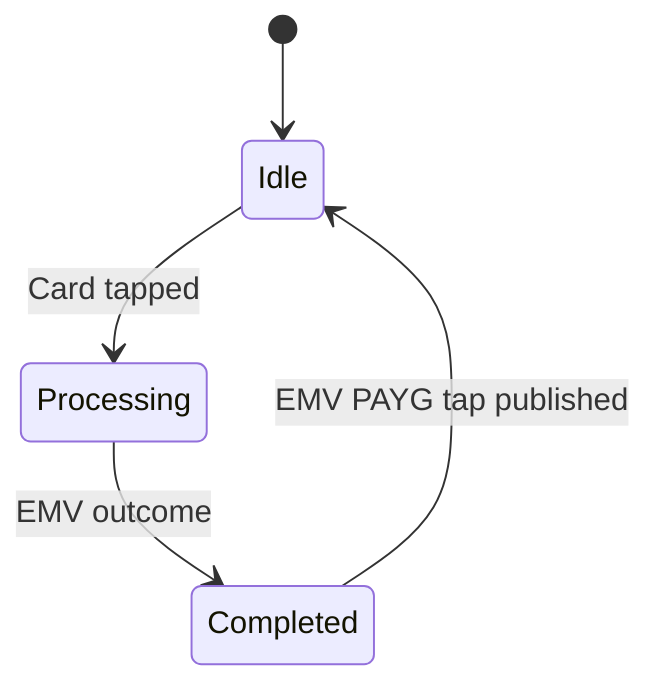
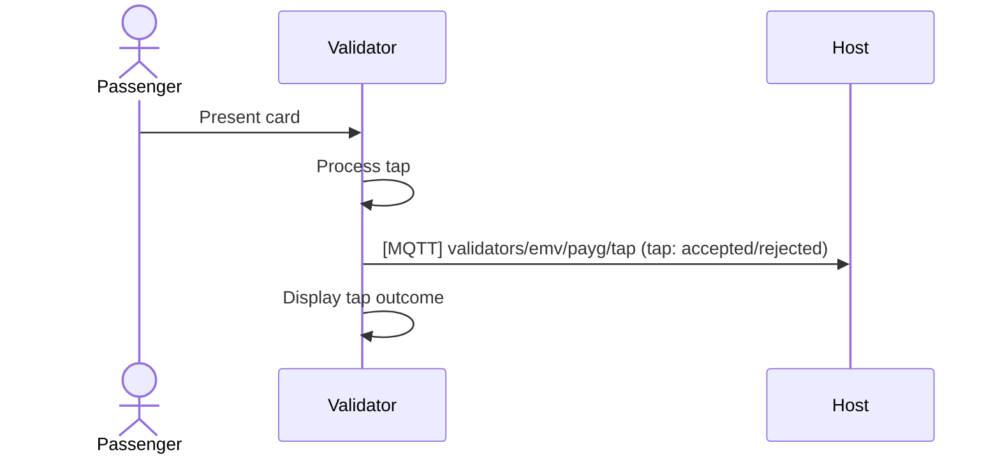

# PAYG state flow

This diagram shows the internal state transitions of a PAYG (Pay-As-You-Go) flow when a passenger taps their payment card. It illustrates how the validator processes a tap and returns to the idle state after completing the EMV transaction.

### States description
- **Idle**: The validator is waiting for a passenger to tap their card.
- **Processing**: The validator reads and processes the EMV card data when a tap is detected.
- **Completed**: The EMV outcome is determined (accepted or rejected), and the result is published.
- **Transition back to Idle**: After publishing the PAYG tap outcome, the validator returns to the idle state, ready for the next tap.

# PAYG sequence diagram

This sequence diagram shows the communication between the passenger, the validator, and the host system over MQTT during a PAYG tap.

### Sequence Description
- **Passenger presents card**: The passenger taps their EMV card on the validator.
- **Validator processes tap**: The validator reads the card, verifies it, and determines the outcome.
- **Publish outcome**: The validator sends an MQTT message with the tap result (accepted or rejected).
- **Display outcome**: The validator shows the result to the passenger (e.g., via LED, screen, or sound).
- **Backend sync**: The validator also sends this tap to the backend system, but that process is outside the scope of this diagram.

# Additional information

## PAYG fare calculation and reports

For accurate fare calculation and reporting, the validator must receive up-to-date journey metadata via MQTT prior to the EMV PAYG tap event. This metadata allows the backoffice system to associate each tap with its operational context (e.g., service, route, or stop).

At a minimum, the stopId must be provided.
- **stopId** – identifies the stop or station where the transaction occurred.

Depending on the fare calculation model and operator configuration, additional identifiers may also be required, such as:
- **serviceId** – identifies the scheduled service on which the validator operates.
- **tripId** – links the tap to a specific trip or journey instance.
- **blockId** – groups multiple trips operated by the same vehicle or driver shift.

Given that multiple standards and data sources may exist for publishing journey information, the origin and structure of the journey metadata must be explicitly defined and documented within this specification to ensure consistent behavior across deployments.